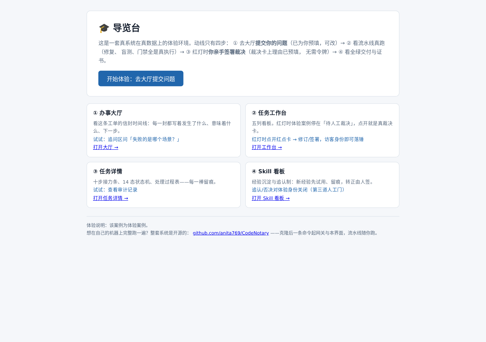
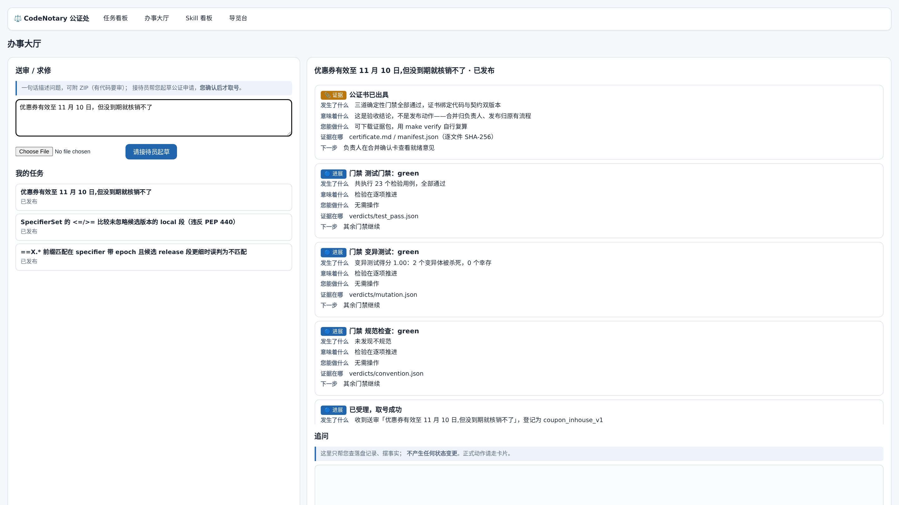
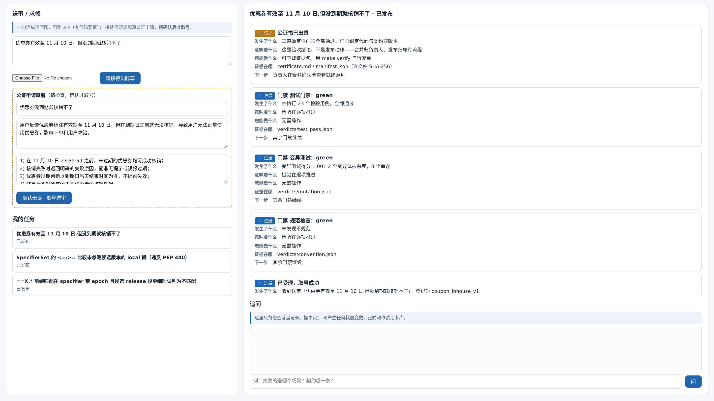
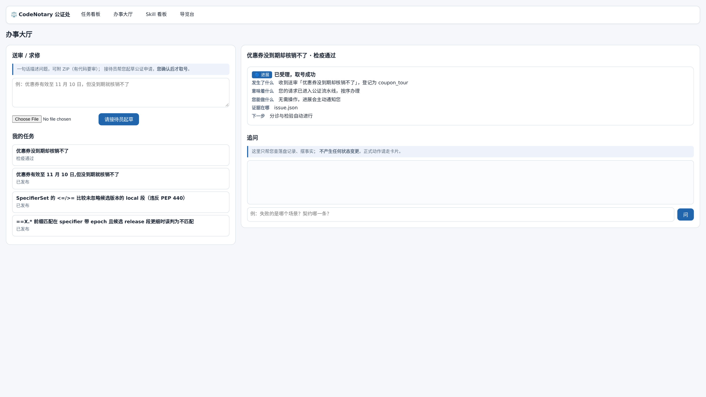
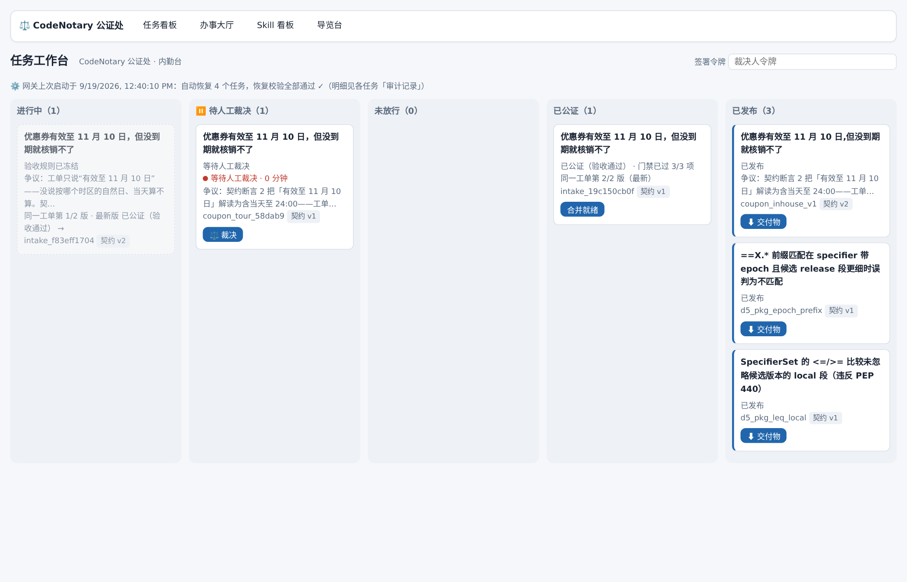
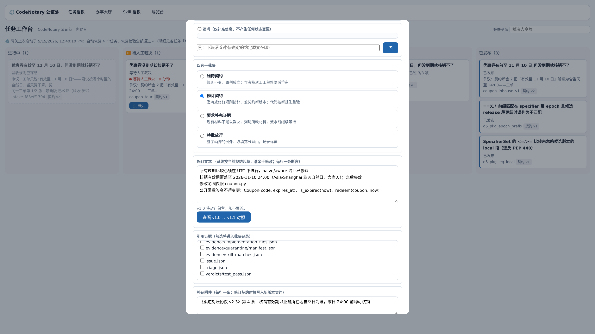
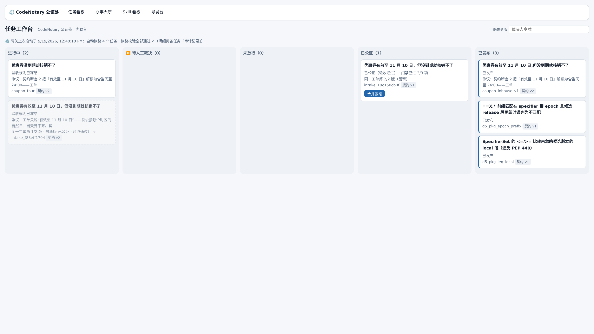
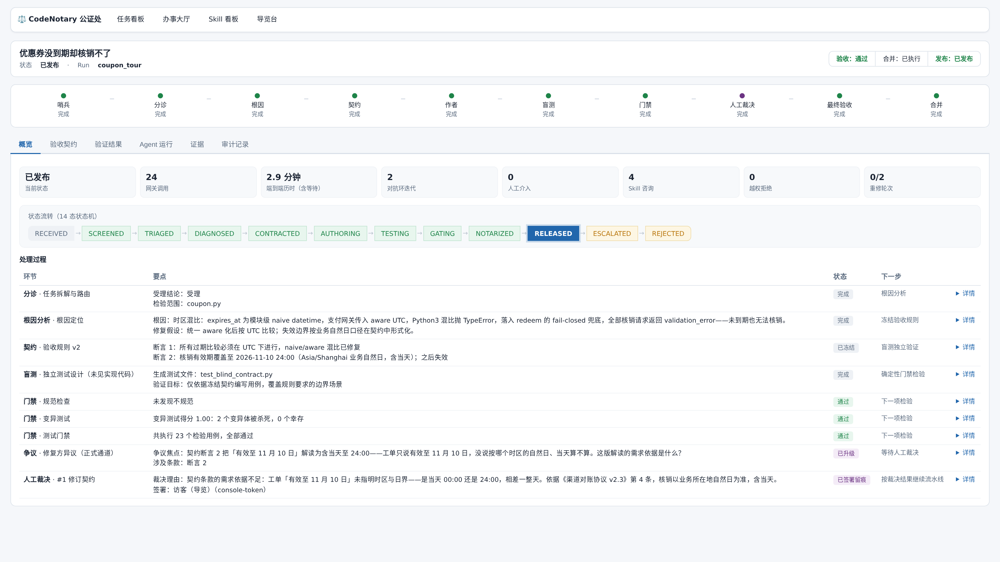
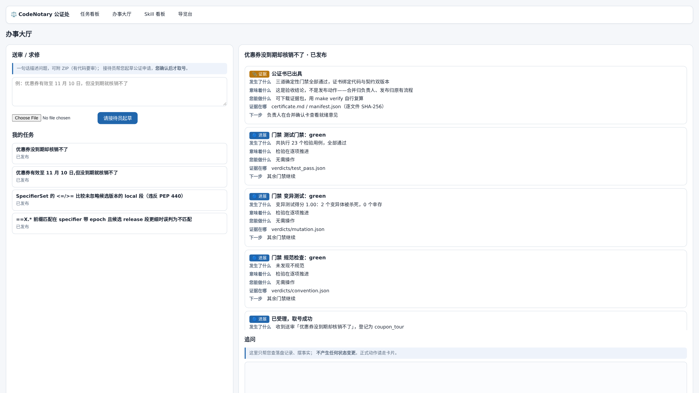

# CodeNotary 体验版操作手册

> 适用对象：访问公网演示站 `https://ara.sciba.cn` 的访客。
> 全程约 4 分钟。支持多人同时体验：每位访客独享一个隔离沙盒实例，
> 进度互不影响（同时最多 3 席，满员时会提示稍后再来）。

## 动线总览

| 步 | 动作 | 在哪 |
|---|---|---|
| ① | 提交你的问题（已预填，可改） | 办事大厅 |
| ② | 看流水线真跑（修复、盲测、门禁全真执行） | 任务详情 / 任务看板 |
| ③ | 红灯时亲手签署裁决（理由已预填，无需令牌） | 任务工作台 · 裁决卡 |
| ④ | 看全绿交付与证书，下载修复好的文件 | 任务工作台 · 交付物卡 |

---

## 第 0 步 · 打开导览台

浏览器访问 `https://ara.sciba.cn/tour`（或从任意页面顶部导航点「导览台」）。

点「**开始体验：去大厅提交问题**」。

## 第 1 步 · 提交你的问题

页面自动跳到办事大厅，输入框里已预填好问题（「优惠券有效至 11 月 10 日，但没到期就核销不了」），你可以直接用它，也可以改成自己的。

点「**请接待员起草**」——接待员（真实 LLM）把你的一句话整理成公证申请草稿：名称、问题描述、验收标准。

检查草稿，点「**确认无误，取号送审**」。你的问题文本会真实写入证据链。

## 第 2 步 · 看流水线真跑

取号成功瞬间，右侧自动切到你这条任务的信封时间线——第一封信是「已受理，取号成功」。

流水线随即开始真跑：哨兵检疫 → 分诊 → 根因定位 → 契约冻结 → 修复 → 盲测 → 门禁。
点「任务详情」（或顶部导航进任务看板再点卡片），可以看到十步接力条逐步推进：

这一步不需要你做任何事。

## 第 3 步 · 亲手签署裁决

红灯后流水线升级挂起。打开「**任务工作台**」（导览台②号位或顶部导航）——你的体验案例停在「⏸ 待人工裁决」列，卡片带红点与等待计时；点卡片上的「**⚖️ 裁决**」直达裁决卡：

裁决卡上：双方立场、冻结时标注的假设、客观检验证据分列；裁决理由与补证附件**已预填**。

勾选 3 项引用证据，滑到底部，点「**确认并签署**」——无需令牌，签署人记为「访客（导览）」，真实写入证据包：

## 第 4 步 · 看全绿交付与证书

签署后系统自动重修：第二稿 → 三门禁重跑全绿 → 公证通过 → 发布封印。
任务详情页可以看到全绿的接力条与证书：

**下载交付物**：回到任务工作台，你的卡片已进入「已发布」列——点卡上的「**⬇ 交付物**」，即可逐件下载修复好的文件（`coupon.py`）与公证书；每个文件都带 SHA-256 指纹，与封印清单逐项可核对：

回到办事大厅，你的任务时间线末尾有一封「📎 公证书已出具」——证书绑定代码与契约双版本，逐文件 SHA-256，可下载证据包自行复算（`make verify`）。

