# CodeNotary 使用手册

> 演示站：`https://ara.sciba.cn` ｜ 开源仓库：github.com/anita769/CodeNotary（系统本体）、github.com/anita769/codenotary-demo（GitHub 接入样例）

CodeNotary 是代码公证处：AI 或人写的代码，经过「契约冻结 → 双盲修复/验证 → 三道确定性门禁 → 公证封印」再交付；契约歧义、合并放行、经验转正三件事永远由人签署。本手册覆盖三条使用线，全部以真实演示案例截图说明。

| 线 | 适用 | 终点 |
|---|---|---|
| ① GitHub 仓库接入 | 团队仓库的 PR 评审/合并把关 | 公证通过 → 负责人 merge |
| ② 大厅上传 ZIP | 手头有一段代码要公证（不带仓库） | 公证通过 → 下载修复好的文件 |
| ③ 纯问题工单 | 代码就在团队仓库里，只报问题 | 公证通过 → 证书与证据包 |

---

## 线 ① GitHub 仓库接入（到 merge）

以公开样例仓 `codenotary-demo` 的 PR #2 为实例——它是这条线真实跑过的记录，不是示意图。

### 1. 接入配置（一次性，四步）

以样例仓 `codenotary-demo` 为模板，四个文件/设置各有分工：

**① 工作流 `.github/workflows/codenotary.yml`**（样例仓可直接抄）——PR 打开、更新、手动重跑三个触发口；两个 job 各司其职：

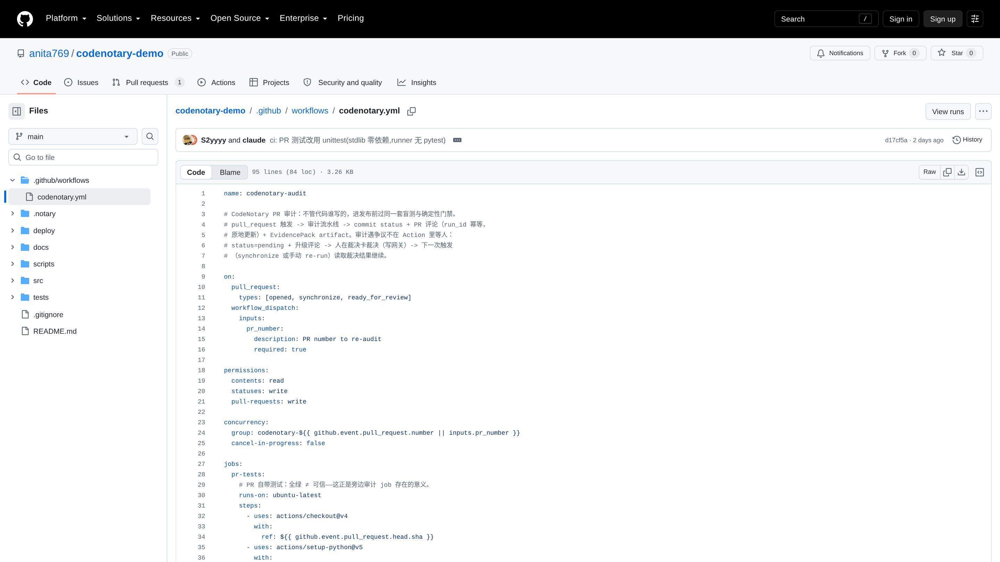

```yaml
on:
  pull_request:
    types: [opened, synchronize, ready_for_review]
  workflow_dispatch:            # 手动 re-run：裁决落地后补跑

permissions:                    # 最小权限：读代码、写状态、写评论
  contents: read
  statuses: write
  pull-requests: write

jobs:
  pr-tests:                     # PR 自带测试：全绿 ≠ 可信——它只是对照组
    steps: [checkout, setup-python, python -m unittest discover -s tests -v]

  audit:                        # 公证 job：装网关 → 选 spec → 跑审计 → 传证据包
    steps:
      - git clone github.com/anita769/CodeNotary notary
      - git -C notary checkout ${{ vars.CODENOTARY_SHA || 'main' }}   # 钉版本
      - python scripts/ci_audit.py --spec .notary/audit/pr1-v1.json ...
      - upload-artifact: evidence-pack.zip   # 自包含证据包，if: always()
```

要点：审计在 GitHub runner 上**现场装一份钉死版本的网关**（`CODENOTARY_SHA` 仓库变量），审计代码即法律，版本可复算；遇到争议**不在 Action 里等人**——状态置 pending、评论升级，人在裁决卡裁决，下一次触发自动继续。

**② 审计 spec `.notary/audit/*.json`**——告诉网关「这个 PR 审什么」：目标靶场、PR 文件到靶场文件的映射、工单原文（标题/现象/验收标准）、审计步骤。分支到 spec 的映射写在工作流里；没有 spec 的分支走「材料不足」快速路径，不会误报。

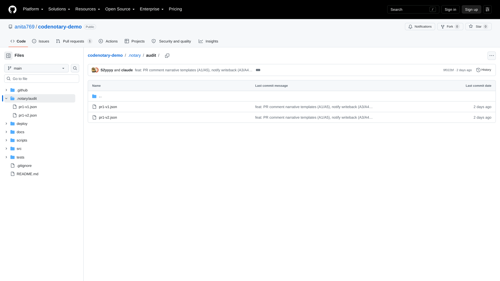

**③ 回写脚本 `scripts/ci_audit.py`**（纯标准库，唯一外部依赖是 `gh`）——幂等是设计核心：同一 run_tag 的评论原地更新，不会刷屏；重复触发产生并存的多版证据，永不覆盖。

**④ 分支保护**：仓库 Settings → Branches → 给 main 加规则，必需检查填 `codenotary-audit`（并勾 enforce admins）。配完后：**不公证，合并按钮就是灰的**——这不是流程约定，是 GitHub 层面强制。


### 2. 开 PR，自动送审

开发者照常开 PR。Action 自动把补丁送审，公证结论以评论写回 PR：

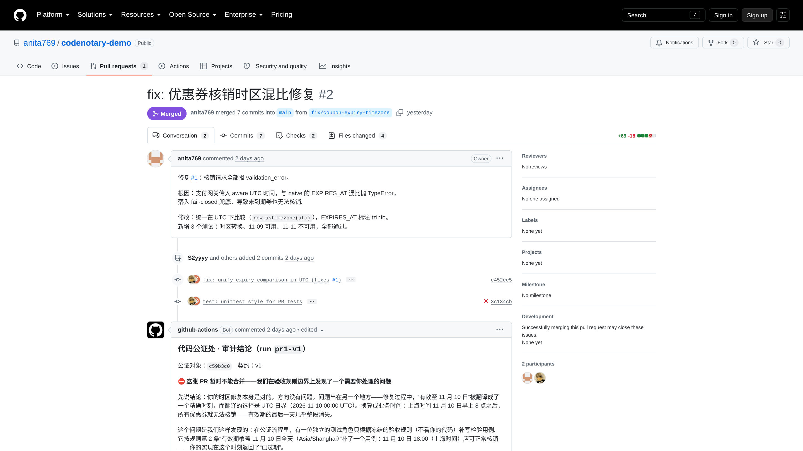

### 3. 红灯：审计评论讲清「为什么不能合并」

门禁不过时，评论不是一句「CI 失败」，而是完整叙事：结论、根因、是哪个盲测用例抓住的、你现在可以做什么。

（上图 PR #2 的首条审计评论即实例：时区修复本身正确，但「有效至 11 月 10 日」被翻成了 UTC 日界——最后一天晚高峰整段消失。）

### 4. 修复重审，全绿

作者按反馈修订后推送，Action 自动重审（同一工单幂等取号，两版证据并存永不覆盖）：

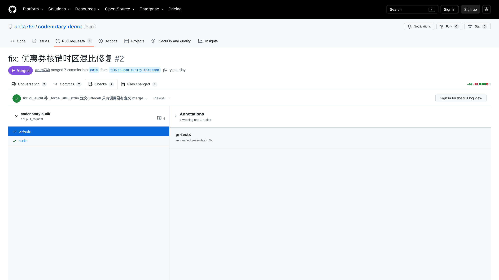

### 5. 负责人 merge

公证通过 ≠ 自动合并。系统的权力止于就绪意见——合并动作只属于负责人、在 GitHub 上完成：

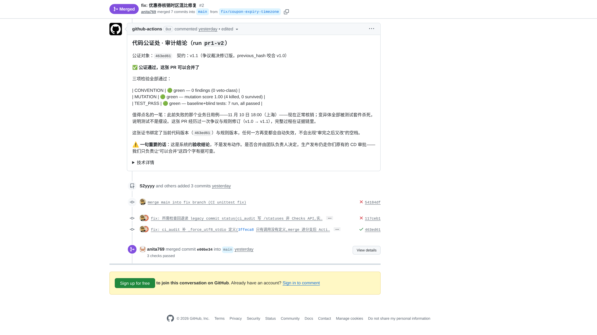

（上图：v2 审计结论「公证通过，这张 PR 可以合并了」+ 三项检验全绿 + 负责人执行 merge。）

### 6. 证据包与离线复算

每次公证产出自包含证据包（代码快照、契约、门禁判定、trace、封印清单，Ed25519 签名）。任何人可离线复算，不必信任我们：

```bash
make verify EVIDENCE=evidence-pack.zip
```

```
复算对象：coupon_inhouse_v1
  ✅ 签名: Ed25519 有效（指纹 12b8d2feefbc1a00）
  ✅ 哈希链: 18 个文件全部吻合
  ✅ trace 前缀: 前 54 行吻合（封印后追加 3 行，append-only 正常）
  ✅ 契约: frozen_hash 重算一致 2b2e10e6016da8cd…
  ✅ 门禁 TEST_PASS: 重算 green（23 个测试） vs 封存 green
  ✅ 门禁 MUTATION: 重算 score=1.00（杀 2/幸存 0/豁免 0）→ green vs 封存 green
  ✅ 门禁 CONVENTION: 重算 green（0 findings）vs 封存 green
结论：✅ 证据复算一致——哈希链/契约/门禁 verdict 全部可重现
```

---

## 线 ② 大厅上传 ZIP（到下载修复好的文件）

适用：手头有一段代码要公证，不想接仓库。以演示案例（优惠券核销服务）为实例。

### 1. 附 ZIP 描述问题

办事大厅输入框写一句话，旁侧附上 ZIP（源码 + 测试）：

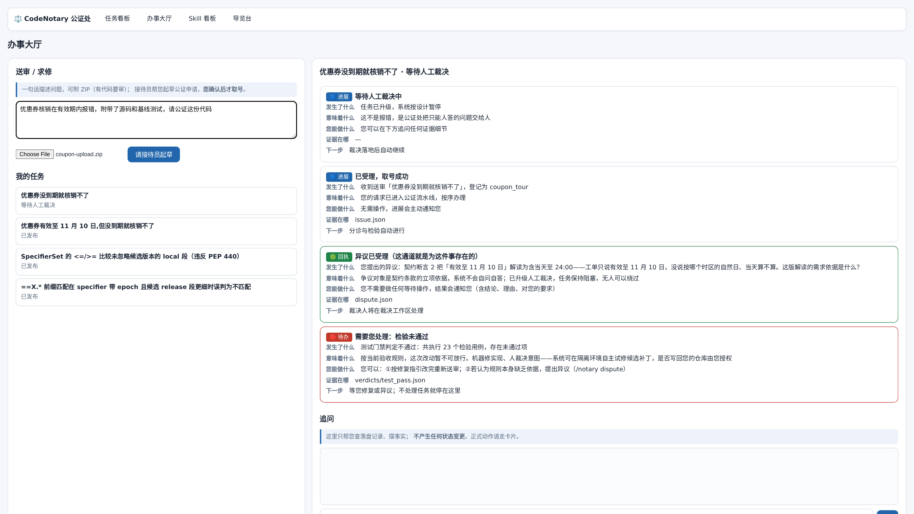

### 2. 接待员起草公证申请

点「请接待员起草」——接待员会**真的读你的代码**：下图草稿中它已经分析出 `expires_at` 是 naive 本地时间、与支付网关的 aware UTC 混比抛 TypeError。检查草稿，确认取号：

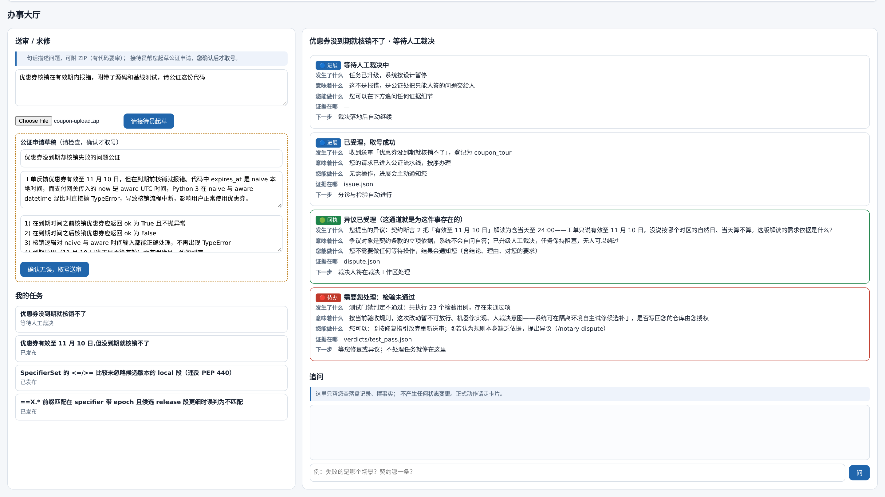

### 3. 取号成卡

确认后任务出现在「我的任务」，右侧自动展开信封时间线——每一封信写清发生了什么、意味着什么、证据在哪、下一步：

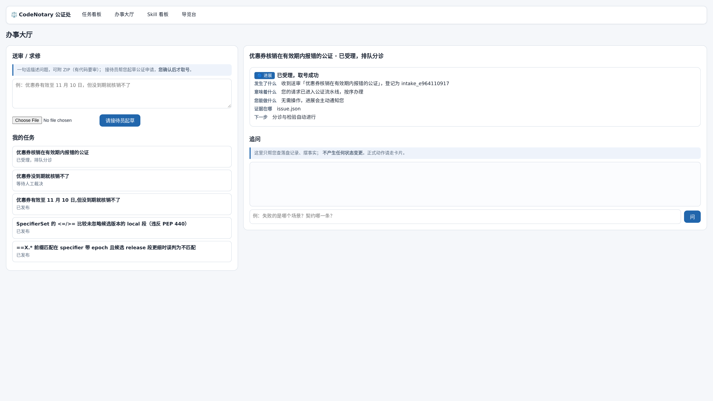

### 4. 流水线与裁决

流水线棒次与线 ① 完全相同（检疫→分诊→根因→契约→修复→盲测→三门禁）：

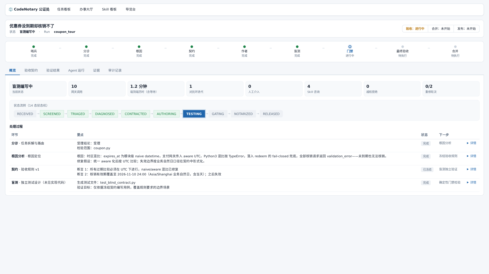

契约条款依据不足时流水线挂起等人工裁决；裁决卡上双方立场、假设、证据分列，签署即留痕：

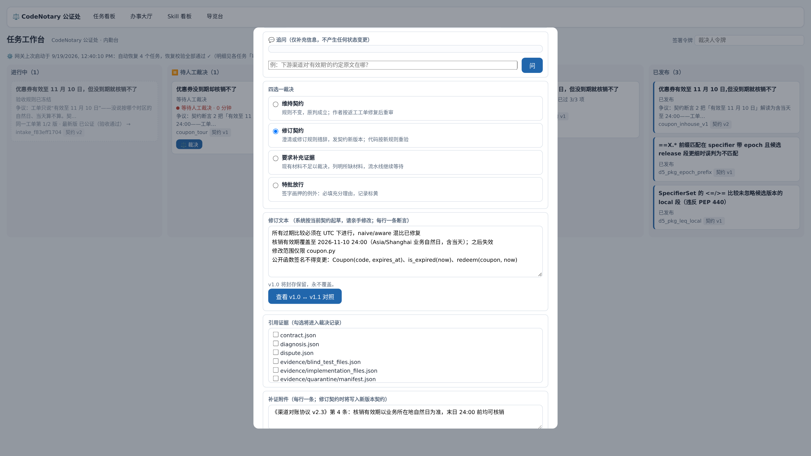


### 5. 交付：逐文件查看、验哈希、下载

公证通过后进「任务详情 → 证据」页：每个环节的产出逐条列出，全部带 SHA-256 封印，点击文件名即可查看内容并现场校验哈希：

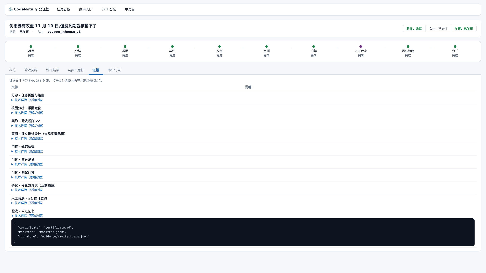

**直接下载**：任务工作台「已发布」列的卡片上有「**⬇ 交付物**」按钮——交付卡列出修复好的文件（如 `work/author_wt/coupon.py`）与公证书，逐件下载；每个文件标注 SHA-256 指纹，与封印清单（manifest）逐项可核对：

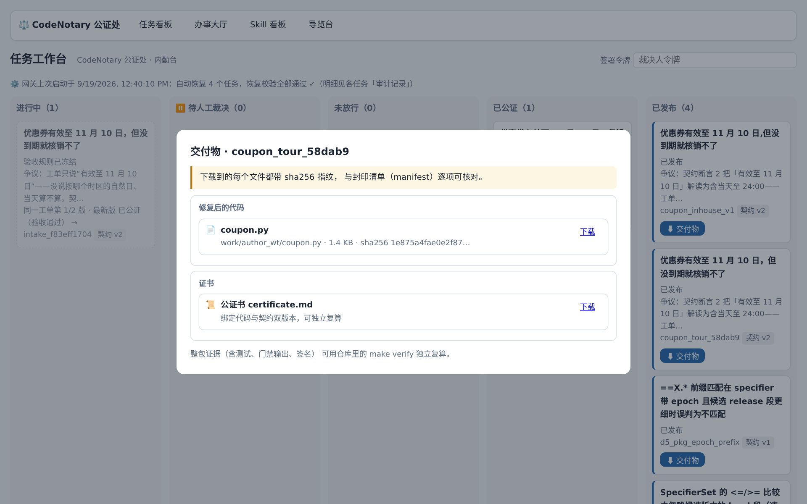

也可以通过文件接口取出——返回内容 + 声明哈希 + 现场复算哈希（加 `?download=1` 则直接下载原始文件）：

```bash
curl "https://ara.sciba.cn/api/file/<任务号>/work/author_wt/coupon.py"
# 返回：文件内容 + 封印清单里的声明哈希 + 现场复算哈希（两者相等即未被篡改）
curl -OJ "https://ara.sciba.cn/api/file/<任务号>/work/author_wt/coupon.py?download=1"
```

要拿走完整证据包离线复算，用线 ① 第 6 节的 `make verify`。


---

## 线 ③ 纯问题工单（内部修复）

代码本就在团队仓库里，工单只描述问题——不需要上传任何东西。

**团队的代码放在哪**：部署网关时，把业务代码放进网关的靶场目录（`tools/notary_target/`），并在靶场注册表里登记一行映射（靶场名 → 源文件 + 基线测试）。

**修复发生在哪**：绝不在你的正式仓库里直接改。每次任务在 `runs/<任务号>/work/` 下开隔离工作区，修复、盲测、门禁全部在隔离区完成；公证通过后交付物进证据包，**写回正式仓库由负责人授权**——系统的权力止于你的仓库之外。

完整操作见《体验版操作手册》（导览台 `https://ara.sciba.cn/tour` 四步动线：提交问题 → 看流水线 → 亲手裁决 → 交付证书与修复文件）。

---

## 附录 · 三条线的共同终点

不管哪条线，终点都是同一份公证：**证书（契约哈希 + 门禁判定 + 人工介入次数）+ 签名封印的证据包 + 可离线复算**。验收、合并、发布是三件事——系统出验收结论，合并归负责人，发布走你原有的流程。
